# SOC Home Lab - Attack Detection & SIEM Monitoring


## Project Overview

A fully operational home Security Operations Center (SOC) lab built to simulate real-world attack scenarios and demonstrate enterprise-grade threat detection capabilities. This lab mirrors the architecture used by professional SOC teams, featuring an attacker machine, vulnerable target, and centralized SIEM for monitoring and alerting.

---

## Lab Architecture

```
VMware Workstation Pro (Host: Windows PC - 32GB RAM)
│
├── Kali Linux 2025.4 (Attacker)
│   ├── IP: 192.168.222.128
│   ├── Role: Offensive operations
│   └── Wazuh Agent: Active (monitored by SIEM)
│
├── Metasploitable 2 (Target)
│   ├── IP: 192.168.222.130
│   ├── Role: Intentionally vulnerable target
│   └── OS: Ubuntu 8.04 (Linux 2.6.24)
│
└── Ubuntu Server 22.04 LTS (SIEM)
    ├── IP: 192.168.222.129 (Static - permanently assigned)
    ├── Role: Centralized security monitoring
    └── Stack: Wazuh v4.14.7 (All-in-One)
        ├── Wazuh Manager    (Threat detection engine)
        ├── Wazuh Indexer    (Data storage & search)
        ├── Wazuh Dashboard  (Web UI - port 443)
        └── Filebeat         (Log shipping)
```

---

## Tools & Technologies

| Category | Tool | Version |
|----------|------|---------|
| SIEM | Wazuh | v4.14.7 |
| Attacker OS | Kali Linux | 2025.4 |
| Target OS | Metasploitable | 2 |
| SIEM OS | Ubuntu Server | 22.04 LTS |
| Hypervisor | VMware Workstation Pro | Latest |
| Recon | Nmap | Built-in Kali |
| Exploitation | Netcat (nc) | Built-in |
| Brute Force | Hydra | v9.6 |
| Framework | MITRE ATT&CK | v14 |

---

## Attack Scenarios Executed

### 1. Network Reconnaissance (T1046 - Network Service Scanning)

**Tool:** Nmap service version scan  
**Command:**
```bash
nmap -sV 192.168.222.130
```

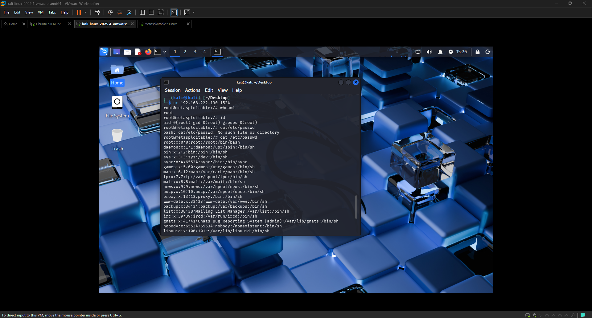

**Findings - 20+ Open Vulnerable Services:**
```
Port 21    - ProFTPD 1.3.1          (FTP backdoor CVE-2010-4221)
Port 22    - OpenSSH 4.7p1          (Outdated, brute force target)
Port 23    - Telnet                  (Cleartext credentials)
Port 80    - Apache 2.2.8            (Multiple web vulnerabilities)
Port 139   - Samba 3.X               (SMB exploitation)
Port 445   - Samba 3.X               (EternalBlue style attacks)
Port 1524  - Metasploitable shell    (BACKDOOR - direct root access)
Port 2121  - ProFTPD 1.3.1           (FTP service)
Port 3306  - MySQL 5.0.51a           (Database exposure)
Port 5432  - PostgreSQL 8.3.0        (Database exposure)
Port 5900  - VNC 3.3                 (Remote desktop)
Port 6667  - UnrealIRCd              (IRC backdoor)
Port 8180  - Apache Tomcat 1.1       (Web application attacks)
```

---

### 2. Backdoor Exploitation (T1078 - Valid Accounts)

**Tool:** Netcat (nc)  
**Target:** Port 1524 (Metasploitable root backdoor)  
**Command:**
```bash
nc 192.168.222.130 1524
```

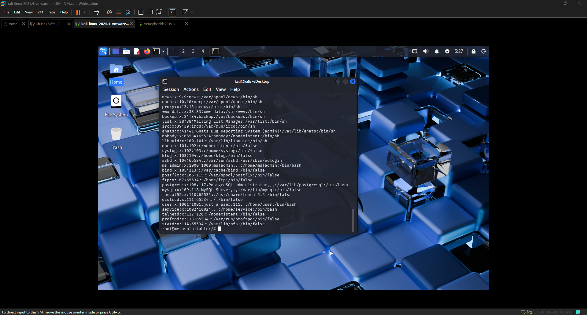

**Result: Immediate root shell obtained**
```
root@metasploitable:/# whoami
root
root@metasploitable:/# id
uid=0(root) gid=0(root) groups=0(root)
```

**MITRE ATT&CK Mapping:**
- T1078 - Valid Accounts
- T1548.003 - Abuse Elevation Control Mechanism: Sudo and Sudo Caching

---

### 3. Post-Exploitation Enumeration (T1082 - System Information Discovery)

**Commands executed after gaining root:**
```bash
uname -a      # System info
cat /etc/passwd  # User enumeration
ls /home      # Home directories
ps aux        # Running processes
netstat -tulpn  # Active connections
```

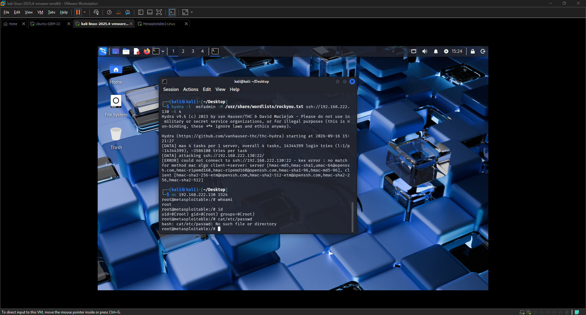

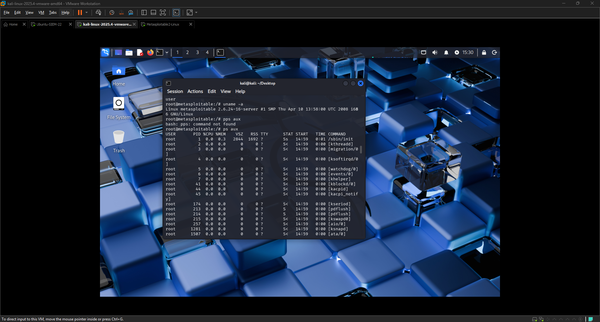

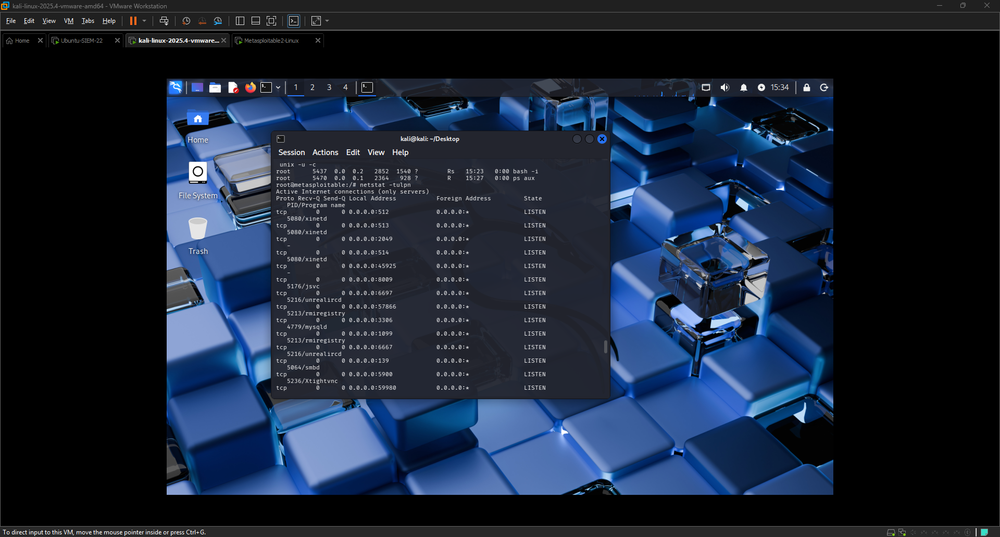

**Key findings:**
- OS: Linux metasploitable 2.6.24-16-server (2008)
- Users: 20+ accounts including msfadmin, postgres, mysql, tomcat55
- Home dirs: ftp, msfadmin, service, user
- Services running as root: MySQL, PostgreSQL, Apache Tomcat, VNC

---

### 4. Brute Force Attempt (T1110 - Brute Force)

**Tool:** Hydra  
**Target:** SSH service (Port 22)
```bash
hydra -l msfadmin -P /usr/share/wordlists/rockyou.txt ssh://192.168.222.130 -t 4
```
> **Note:** Failed due to legacy key exchange algorithms on Metasploitable 2

---

## SIEM Detection Results

### Wazuh MITRE ATT&CK Dashboard

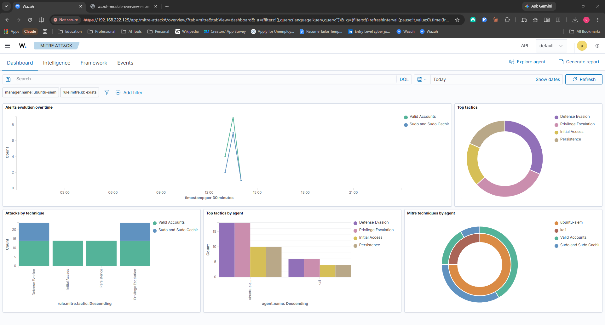

**Total Alerts Generated: 24**

| MITRE ID | Tactic | Technique | Description | Count |
|----------|--------|-----------|-------------|-------|
| T1078 | Defense Evasion, Persistence, Privilege Escalation, Initial Access | Valid Accounts | PAM: Login session opened | 12 |
| T1548.003 | Privilege Escalation, Defense Evasion | Sudo and Sudo Caching | Successful sudo to ROOT executed | 12 |

---

### Wazuh Events - Kali Agent (Attacker Machine)

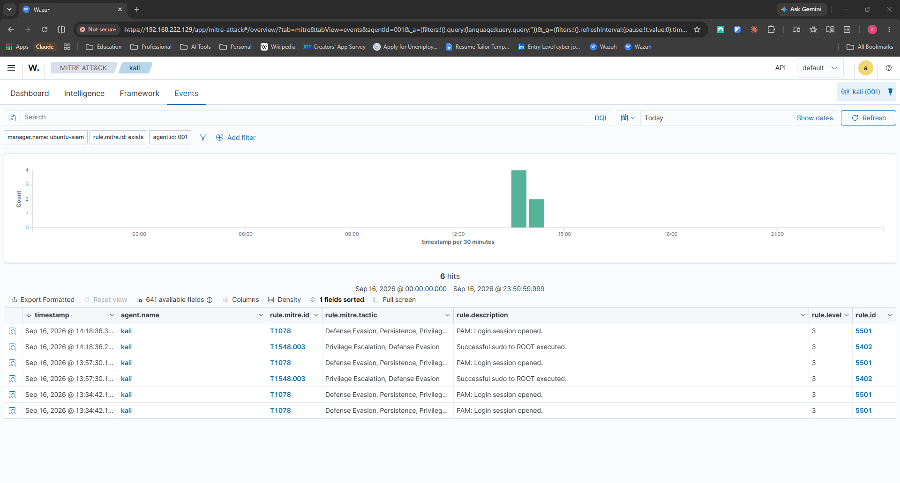

---

### All Agents - 24 Total Hits

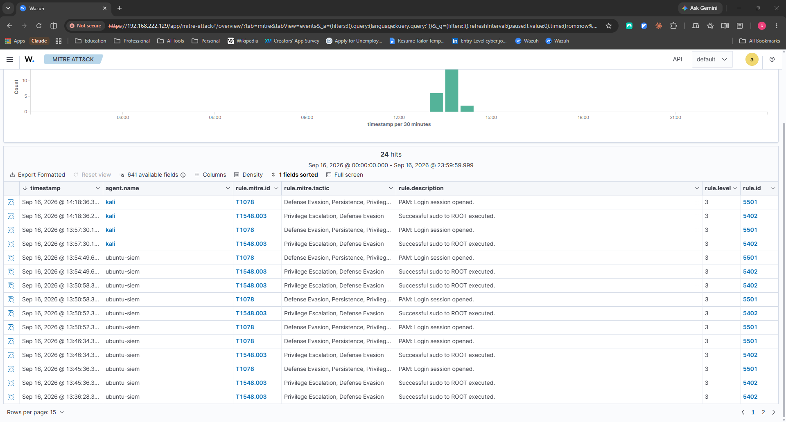

---

### Alert Document Details

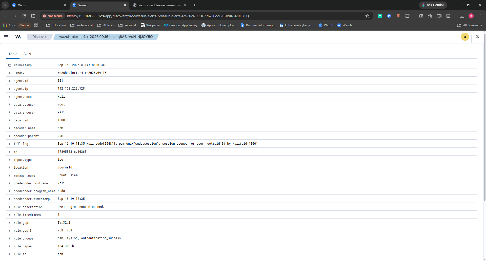

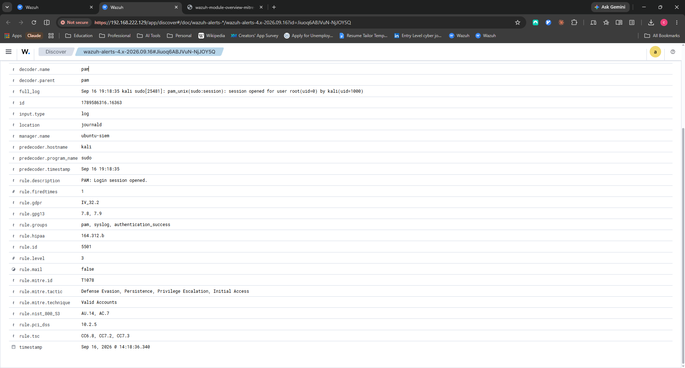

**Sample Alert:**
```
Alert Index:     wazuh-alerts-4.x-2026.09.16
Agent ID:        001
Agent IP:        192.168.222.128 (Kali - Attacker)
Agent Name:      kali
Data DST User:   root
Data SRC User:   kali
Program:         sudo
Rule ID:         5501 / 5402

Full Log:
Sep 16 19:18:35 kali sudo[25481]: pam_unix(sudo:session): 
session opened for user root(uid=0) by kali(uid=1000)
```

---

### Compliance Frameworks Auto-Mapped by Wazuh

| Framework | Controls Triggered |
|-----------|-------------------|
| GDPR | IV_32.2 |
| HIPAA | 164.312.b |
| PCI-DSS | 10.2.5 |
| NIST 800-53 | AU.14, AC.7 |
| TSC | CC6.8, CC7.2, CC7.3 |
| GPG13 | 7.8, 7.9 |

---

## Attack Kill Chain

```
1. RECONNAISSANCE
   └── Nmap -sV scan identified 20+ vulnerable services
   
2. INITIAL ACCESS
   └── Netcat connection to backdoor port 1524
   
3. EXECUTION
   └── Direct shell access obtained
   
4. PRIVILEGE ESCALATION
   └── Already root (uid=0) via backdoor
   
5. DISCOVERY
   ├── System info: uname -a
   ├── User enumeration: cat /etc/passwd
   ├── Process list: ps aux
   └── Network services: netstat -tulpn
   
6. DETECTION (by Wazuh SIEM)
   ├── T1078 detected (Login session)
   ├── T1548.003 detected (Sudo to root)
   ├── 24 alerts generated
   └── Mapped to 6 compliance frameworks
```

---

## Lab Setup

### Prerequisites
- Windows PC (8GB+ RAM recommended, 32GB used here)
- VMware Workstation Pro
- 50GB+ free disk space

### VM Specifications

| VM | RAM | CPU | Disk | OS |
|----|-----|-----|------|-----|
| Ubuntu SIEM | 6GB | 2 cores | 40GB | Ubuntu 22.04 LTS |
| Kali Linux | 4GB | 4 cores | 80GB | Kali 2025.4 |
| Metasploitable | 512MB | 1 core | 8GB | Ubuntu 8.04 |

### Network Configuration

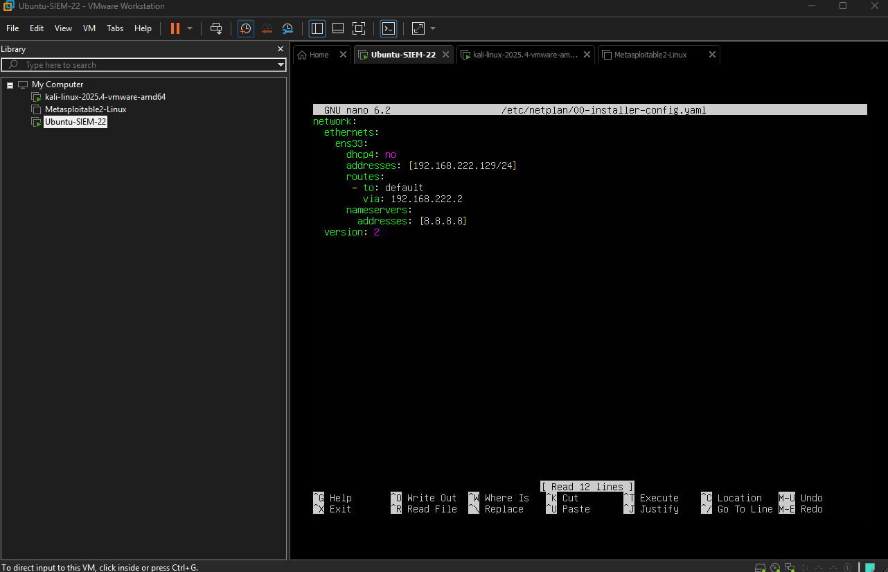

```
Network Type: VMware NAT (192.168.222.0/24)
SIEM IP:      192.168.222.129 (Static via netplan)
Kali IP:      192.168.222.128 (DHCP)
Target IP:    192.168.222.130 (DHCP)
```

### Wazuh Installation
```bash
# Download and run all-in-one installer
curl -sO https://packages.wazuh.com/4.14/wazuh-install.sh
sudo bash ./wazuh-install.sh -a

# Access dashboard
https://192.168.222.129
```

---

## Key Learnings

1. **Virtualization** - Configured multi-VM lab with VMware Workstation, managing network segments and resource allocation

2. **SIEM Deployment** - Installed and configured enterprise-grade Wazuh SIEM including indexer, manager, dashboard, and Filebeat

3. **Network Reconnaissance** - Used Nmap to identify 20+ vulnerable services with version detection

4. **Exploitation** - Exploited backdoor vulnerability for immediate root access via netcat

5. **Post-Exploitation** - Enumerated users, processes, and network services after gaining access

6. **Threat Detection** - Observed how SIEM correlates logs and maps to MITRE ATT&CK framework in real-time

7. **Compliance Mapping** - Security events automatically mapped to GDPR, HIPAA, PCI-DSS, and NIST 800-53

8. **Linux Administration** - Configured static IP using netplan, managed services with systemctl

---

## Disclaimer

This lab is built entirely in an isolated virtual environment for educational purposes only. All attacks were performed against intentionally vulnerable machines within a private network. No real systems were targeted. Always practice ethical hacking within legal boundaries.

---

## Resources

- [Wazuh Documentation](https://documentation.wazuh.com/)
- [MITRE ATT&CK Framework](https://attack.mitre.org/)
- [Kali Linux Tools](https://www.kali.org/tools/)
- [Metasploitable 2 Guide](https://docs.rapid7.com/metasploit/metasploitable-2/)
- [Nmap Reference](https://nmap.org/book/man.html)

---

## Author

**Cody Thomassie**  
Cybersecurity Enthusiast | Sales Professional | SOC Analyst (Aspiring)  
codyrthom@gmail.com  
[LinkedIn](https://linkedin.com/in/codythom)

---

*Built as part of hands-on cybersecurity learning journey - September 2026*
